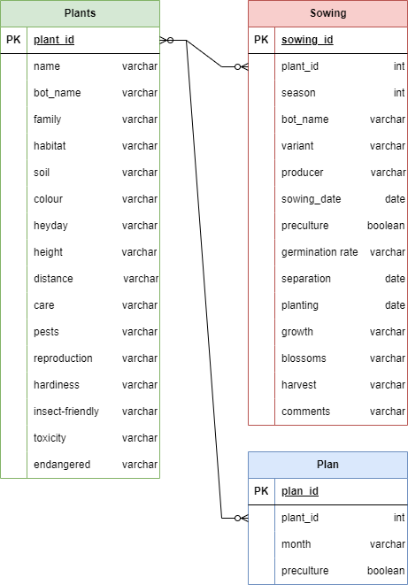

# Garden Website - from HTML to SQL/PHP

2024-02-12

The [garden website](https://github.com/SebaRade/User_Story_Garden_Website) started out as a small project, but over time the number of files became too large and impractical. Sooner or later, the information had to be stored appropriately in an SQL database.
So I set about scraping my HTML files, transferring the data to the database and integrating it into the website via PHP.

 

 

The information on the plants was stored in tabular form in over 220 HTML files. As I had designed all the files identically, I was fortunately able to scrape and migrate the data in a batch. To do this, I wrote a Python script to open the files sequentially, transform them into a BeatifulSoup object and select the corresponding tables. I saved the extracted data in a CSV file and imported it into a mySQL database using the import wizard.

 

 

The website is only intended for my private use. I therefore used an Apache web server to enable the integration of the mySQL database using PHP on my local machine.
